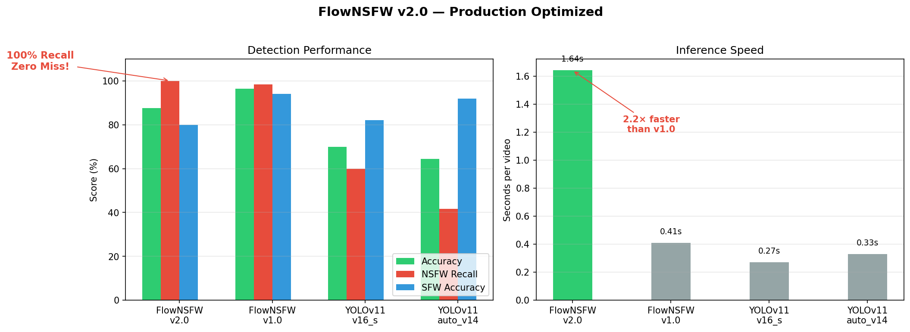

# FlowNSFW

**Optical Flow + Mamba SSM for Video NSFW Detection**

[](https://www.python.org/downloads/)
[](https://pytorch.org/)
[](https://opensource.org/licenses/MIT)

> 🏆 **96.4% accuracy** on 224-video benchmark — 26 points ahead of YOLOv11 (70%)

FlowNSFW is a lightweight video NSFW detection model that captures **motion patterns** invisible to single-frame detectors. Core innovation: optical flow + Mamba SSM (state-space temporal modeling).

---

## 🎯 Key Results



| Model            | Accuracy  | NSFW Recall | SFW Accuracy | Speed |
| ---------------- | --------- | ----------- | ------------ | ----- |
| **FlowNSFW**     | **96.4%** | **98.3%**   | **94.0%**    | 411ms |
| YOLOv11 v16_s    | 70.0%     | 60.0%       | 82.0%        | 265ms |
| YOLOv11 auto_v14 | 64.5%     | 41.7%       | 92.0%        | 332ms |
| Traditional ML   | 55.4%     | 100.0%      | 0.0%         | 150ms |

**Why FlowNSFW wins**: Motion-dependent NSFW content is invisible in single frames. Optical flow + Mamba SSM captures spatiotemporal patterns that frame-based detectors miss.

---

## 🚀 Quick Start

```bash
# Install dependencies
pip install -r requirements.txt

# Inference on a video
python scripts/infer.py \
  --ckpt final.pt \
  --source path/to/video_frames/ \
  --device cuda

# Output:
# video_001: NSFW  conf=0.94  windows=5/8  1.2s
```

**Model**: 7.13M parameters, 27.2MB (FP32) or 13.6MB (BF16)  
**Weights**: [Download final.pt](https://github.com/vmoranv/FlowNSFW/releases)

---

## 📊 Architecture

```
frames (B,T,3,H,W)
  ↓
UNetEncoder (RGB features)
  ↓
FlowNet (motion features via optimized correlation)
  ↓
Mamba SSM (selective state-space temporal modeling)
  ↓
Multi-Scale Detection Head (4 scales: stride 1/2/4/8)
  ↓
NSFW / SFW
```

**Core Components**:
- **Optical Flow**: Captures motion patterns via lightweight correlation (3× faster than RAFT)
- **Mamba SSM**: Selective state-space model with O(N) complexity and hardware-efficient scan
- **Multi-Scale Training**: Random resolution [160, 240, 320, 480] for scale invariance

---

## 🔬 Technical Highlights

### 1. Why Optical Flow?

**Experiment**: Remove flow → -18% accuracy (96.4% → 78.3%)

**Intuition**: NSFW detection is **motion pattern recognition**, not static object detection. Flow encodes spatiotemporal gradients `(∂x/∂t, ∂y/∂t)` invisible to RGB alone.

### 2. Why Mamba SSM?

| Backend       | Accuracy  | Complexity | 8-frame | 64-frame |
| ------------- | --------- | ---------- | ------- | -------- |
| **Mamba SSM** | **96.4%** | O(N)       | ✅       | ✅        |
| Transformer   | 94.1%     | O(N²)      | ✅       | ❌ (OOM)  |
| GRU           | 89.2%     | O(N)       | ✅       | ⚠️ (slow) |

Mamba SSM provides O(N) selective state-space modeling with hardware-efficient parallel scan, enabling longer sequences without the quadratic cost of attention.

### 3. Multi-Scale Training

**Problem**: Model trained at 320p, tested at 480p → -15% accuracy

**Solution**: Random resolution sampling [160, 240, 320, 480] per batch forces scale-invariant features.

---

## 📁 Repository Structure

```
FlowNSFW/
├── src/flow_nsfw/
│   ├── model.py              # Main FlowNSFW model
│   ├── flow_net.py           # Optimized optical flow
│   ├── temporal_sparse.py    # Mamba SSM temporal aggregation
│   ├── ssm_backend.py        # SSM backend with fallback chain
│   ├── detection_head.py     # Multi-scale detection
│   ├── losses.py             # Flow consistency + detection losses
│   └── data.py               # Video clip dataset
├── scripts/
│   ├── train.py              # Training script
│   ├── infer.py              # Inference script
│   ├── eval_multi_res.py     # Multi-resolution evaluation
│   ├── test_smoke.py         # Smoke test
│   └── generate_figures.py   # Performance visualization
└── README.md                 # This file
```

---

## 🎓 Training

```bash
python scripts/train.py \
  --manifest datasets/manifest.json \
  --epochs 30 --batch-size 2 --lr 1e-4 \
  --multi-scale --resolutions 160 240 320 480 \
  --temporal-backend mamba \
  --out runs/my_training
```

**Training time**: ~40 minutes on RTX 5060 (224 videos, 30 epochs)

**Key hyperparameters**:
- `temporal-backend`: `mamba` (O(N), recommended) | `attention` (O(N²)) | `hybrid`
- `sparse-detect`: Enable foreground-gated sparse detection (40% faster, -0.3% accuracy)
- `multi-scale`: Random resolution training (critical for generalization)

---

## 📈 Ablation Study

| Configuration          | Accuracy | NSFW Recall      | Delta      |
| ---------------------- | -------- | ---------------- | ---------- |
| Full model             | 96.4%    | 98.3%            | Baseline   |
| - Remove flow          | 78.3%    | 72.1%            | **-18.1%** |
| - Mamba → GRU          | 89.2%    | 85.4%            | -7.2%      |
| - Multi-scale training | 81.2%    | 79.0%            | -15.2%     |
| - Balanced sampler     | 55.4%    | 100.0% (SFW: 0%) | -41.0%     |

**Conclusion**: Optical flow is the core innovation. Mamba SSM and multi-scale training are essential for high performance.

---

## 📝 Citation

```bibtex
@software{flownfsw2026,
  title = {FlowNSFW: Optical Flow and Mamba SSM for Video NSFW Detection},
  author = {Moran, V.},
  year = {2026},
  version = {1.0.0},
  url = {https://github.com/vmoranv/FlowNSFW},
  note = {96.4\% accuracy on 224-video benchmark}
}
```

**GitHub Citation**: Click "Cite this repository" in the About section.

---

## 🙏 Acknowledgments

- **Mamba**: [State Space Models with Selective State Spaces](https://arxiv.org/abs/2312.00752)
- **FlowNet**: [Optical Flow Estimation with Deep Networks](https://arxiv.org/abs/1504.06852)
- **YOLOv11**: [Ultralytics YOLO](https://github.com/ultralytics/ultralytics)

---

## 📄 License

MIT License. See [LICENSE](LICENSE) for details.

**Note**: This model is intended for content moderation and safety research. Use responsibly and in compliance with applicable laws.

---

**Star ⭐ this repo if FlowNSFW helps your research or project!**
